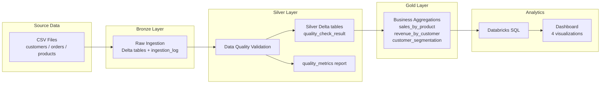

# Databricks Medallion Pipeline

End-to-end e-commerce analytics pipeline on **Databricks** using the **Medallion Architecture** (Bronze → Silver → Gold → SQL Dashboard). Raw CSV sources are ingested unchanged, validated with explicit data-quality checks, aggregated into business-ready Gold tables, and exposed through a Databricks SQL dashboard for stakeholder insights.

**Repository:** `databricks-medallion-pipeline-st-9124`

---

## Business Problem

An e-commerce company receives daily data from three operational systems:

- **Customer master** (`customers.csv`)
- **Order transactions** (`orders.csv`)
- **Product catalog** (`products.csv`)

Stakeholders need trusted analytics on product performance, customer revenue, and customer behavior segments. The challenge is that source data contains realistic quality issues (~700 intentional defects in sample data): NULL emails, duplicate keys, orphan foreign keys, and invalid values. The pipeline must **detect and flag** bad data without silently dropping records, then build aggregations only from eligible, business-valid records.

---

## What This Project Does

| Stage | Outcome |
|-------|---------|
| **Sample data** | Generates 10K customers, 100K orders, 500 products with intentional defects |
| **Bronze** | Ingests raw CSVs into Delta tables with ingestion metadata |
| **Silver** | Applies data quality checks, flags failures, reports pass rates |
| **Gold** | Produces three aggregation tables for analytics |
| **Dashboard** | Databricks SQL dashboard with four business visualizations |

All layers include validation scripts that verify row counts, quality outcomes, and aggregation consistency.

---

## Architecture



**Design principles**

- **Bronze = raw:** no cleaning, deduplication, or business transforms
- **Silver = flag, don't delete:** 100% row retention; failures recorded in `quality_failure_reasons`
- **Gold = aggregation-specific eligibility:** not every `FAIL` row is excluded; critical failure codes are defined per entity
- **Explicit schemas:** Bronze, Silver, and Gold use defined structures (not unchecked inference)

---

## Technology Stack

| Component | Technology |
|-----------|------------|
| Platform | Databricks (Community Edition) |
| Storage | Delta Lake, Unity Catalog (`workspace.bronze`, `workspace.silver`, `workspace.gold`) |
| Processing | PySpark, Spark SQL |
| Data generation | Python, pandas, Faker (local) |
| BI | Databricks SQL Dashboard |
| Source files | CSV on DBFS / Unity Catalog Volume |

**Dependencies:** `requirements.txt` (`pyspark`, `delta-spark`, `pandas`, `faker`)

---

## Repository Structure

```
databricks-medallion-pipeline/
├── README.md                          # This file
├── requirements.txt
├── docs/
│   └── assignment.md                  # Project specification
├── data/                              # Sample CSVs (generated)
├── database/
│   └── schema.sql                     # Schema setup notes
├── src/
│   ├── config.py                      # Shared paths and schema names
│   ├── data_generation/               # Sample data generator
│   ├── bronze/                        # Raw ingestion
│   ├── silver/                        # Data quality validation
│   ├── gold/                          # Business aggregations
│   └── dashboard/                     # Dashboard SQL + setup guide
├── design-notes.md                    # Architecture and design decisions
├── data-model.md                      # Entity and table documentation
├── data-quality-strategy.md           # DQ rules and thresholds
├── requirements-analysis.md           # Requirement breakdown
└── ai-prompts/                        # AI-assisted development history
```

---

## End-to-End Data Flow

```
1. Generate CSVs locally
      python src/data_generation/generate_sample_data.py
      -> data/customers.csv, orders.csv, products.csv

2. Upload CSVs to Databricks Volume (or set DATA_PATH locally)

3. Bronze: ingest raw CSVs -> Delta
      workspace.bronze.{customers, orders, products, ingestion_log}

4. Silver: read Bronze -> apply DQ checks -> write flagged Silver tables
      workspace.silver.{customers, orders, products, quality_metrics}

5. Gold: read Silver -> apply eligibility rules -> run SQL aggregations
      workspace.gold.{sales_by_product, revenue_by_customer, customer_segmentation}

6. Dashboard: Databricks SQL queries against Gold tables -> visualizations
```

**Processing order:** products → customers → orders (parents before children in Bronze and Silver).

---

## Layer Responsibilities

### Bronze (`src/bronze/`)

- Reads CSVs with **explicit Spark schemas** and `FAILFAST` mode
- Writes unchanged data to Delta tables
- Adds `_ingest_timestamp` and `_source_file` metadata columns
- Logs row counts to `ingestion_log`
- **Entry point:** `ingest_all.py` | **Validation:** `validate_bronze.py`

### Silver (`src/silver/`)

- Reads Bronze Delta tables
- Runs four **active** quality check modules (see below)
- Adds `quality_check_result`, `quality_failure_reasons`, `_silver_processed_at`
- Writes `quality_metrics` with **% passed per check**
- Enforces **100% row retention** (Bronze row count = Silver row count)
- **Entry point:** `create_silver_tables.py` | **Validation:** `validate_silver.py`

### Gold (`src/gold/`)

- Reads Silver tables
- Registers eligibility temp views (`eligible_orders`, `eligible_products`, `eligible_customers`)
- Runs SQL aggregations and writes three Gold Delta tables
- **Entry point:** `create_gold_tables.py` | **Validation:** `validate_gold.py`

### Dashboard (`src/dashboard/`)

- SQL queries and setup guide for Databricks SQL Dashboard
- See [Dashboard](#dashboard-and-business-insights) below

---

## Silver Layer: Data Quality Checks

Four check modules are **wired into the pipeline** via `create_silver_tables.py`:

| Check | Module | What it validates | Example failure codes |
|-------|--------|-------------------|----------------------|
| **Completeness** | `01_quality_completeness.py` | NULL in critical fields | `COMPLETENESS_EMAIL`, `COMPLETENESS_CUSTOMER_ID`, `COMPLETENESS_PRODUCT_ID` |
| **Uniqueness** | `02_quality_uniqueness.py` | Duplicate primary keys | `UNIQUENESS_CUSTOMER_ID`, `UNIQUENESS_ORDER_ID`, `UNIQUENESS_PRODUCT_ID` |
| **Type validation** | `03_quality_type_validation.py` | Invalid enums and out-of-range values | `TYPE_VALIDATION` (invalid segment/status, quantity ≤ 0, negative stock) |
| **Referential integrity** | `04_quality_referential_integrity.py` | Orphan foreign keys on orders | `RI_CUSTOMER`, `RI_PRODUCT` |

**Quality reporting (cross-cutting):** `silver_utils.write_quality_metrics()` writes pass/fail counts and `pass_pct` per check to `workspace.silver.quality_metrics`.

**Extension placeholder:** `05_quality_business_logic.py` exists in the repo structure but is **not implemented or invoked** (returns no metrics). Business-rule checks such as `total_amount = quantity * unit_price` are a documented future extension, not part of the active pipeline.

**Intentional sample defects caught by Silver** (~700 rows): 50 NULL emails, 10 duplicate customer keys, 100 NULL customer_ids on orders, 200 NULL product_ids, 50 orphan customer_ids, 30 orphan product_ids, 20 duplicate order keys.

---

## Gold Layer: Tables and Business Value

Gold reads **eligible** Silver records using rules in `eligibility.py`:

| Entity | Eligibility summary |
|--------|---------------------|
| **Orders** | `order_status = Completed` and no critical order-level failure codes |
| **Products** | No critical product-level failure codes |
| **Customers** | Only `UNIQUENESS_CUSTOMER_ID` excludes a customer (NULL email does not) |

### `workspace.gold.sales_by_product`

**Purpose:** Product-level sales performance.

| Column | Description |
|--------|-------------|
| `product_id`, `product_name`, `category` | Product identity |
| `total_orders` | Distinct completed eligible orders |
| `total_revenue` | Sum of order amounts |
| `avg_order_value` | Revenue / order count |

**Business value:** Identifies top products, category mix, and revenue concentration.

**Source:** `eligible_orders` INNER JOIN `eligible_products`

### `workspace.gold.revenue_by_customer`

**Purpose:** Customer-level revenue and lifetime metrics.

| Column | Description |
|--------|-------------|
| `customer_id`, `customer_name`, `customer_segment` | Customer identity (segment = Premium/Standard/Basic from source) |
| `total_orders`, `total_revenue`, `avg_order_value` | Order and revenue metrics |
| `lifetime_value_actual` | Sum of eligible completed order revenue (computed, not source `lifetime_value`) |

**Business value:** Ranks customers by revenue, supports CRM and retention analysis.

**Source:** `eligible_orders` INNER JOIN `eligible_customers`

### `workspace.gold.customer_segmentation`

**Purpose:** Behavioral customer segments for marketing and strategy.

| Column | Description |
|--------|-------------|
| `segment_type` | High-Value / Repeat / One-Time / Inactive |
| `customer_count` | Customers in segment |
| `avg_revenue`, `total_revenue` | Segment revenue metrics |

**Business value:** Shows portfolio composition (e.g. how many customers are inactive vs high-value).

**Source:** All `eligible_customers` LEFT JOIN their eligible order metrics, then aggregated by segment.

### Customer Segmentation Logic

Applied per eligible customer based on eligible completed order history (`04_customer_segmentation.sql`):

| Priority | Condition | Segment |
|----------|-----------|---------|
| 1 | `total_revenue >= 1000` (configurable via `SEGMENTATION_HIGH_VALUE_THRESHOLD`) | **High-Value** |
| 2 | `total_orders >= 2` | **Repeat** |
| 3 | `total_orders = 1` | **One-Time** |
| 4 | `total_orders = 0` | **Inactive** |

---

## Dashboard and Business Insights

The live **Databricks SQL Dashboard** is built on Gold tables and includes four visualizations:

| Visualization | Chart type | Gold source | SQL in repo |
|---------------|------------|-------------|-------------|
| **Customer Distribution by Segment** | Pie / Donut | `customer_segmentation` | QUERY 1 |
| **Total Revenue by Customer Segment** | Bar | `customer_segmentation` | QUERY 2 |
| **Top 10 Customers by Revenue** | Bar | `revenue_by_customer` | QUERY 3 |
| **Total Revenue by Product Category** | Bar | `sales_by_product` | QUERY 4 |

**Business insight**

- **Customer Distribution by Segment:** How customers split across High-Value, Repeat, One-Time, and Inactive
- **Total Revenue by Customer Segment:** Which behavioral segments drive the most revenue
- **Top 10 Customers by Revenue:** Highest-value customers for account management
- **Total Revenue by Product Category:** Category-level revenue mix and assortment performance

**SQL:** All four queries are in `src/dashboard/dashboard_queries.sql` (QUERY 1-4). Optional dashboard filters use `customer_segment` on QUERY 3 and `product_category` on QUERY 4, with filter value lists in the FILTER SUPPORT sections of the same file.

**Setup:** See `src/dashboard/DASHBOARD_GUIDE.md` for Databricks SQL Dashboard configuration (QUERY 1-4, filters, and field mappings).

---

## Pipeline Status

| Layer | Status |
|-------|--------|
| Sample data generation | Complete |
| Bronze | Complete and validated on Databricks |
| Silver | Complete and validated on Databricks |
| Gold | Complete and validated on Databricks |
| Dashboard | Complete (Databricks SQL Dashboard with 4 visualizations) |

---

## How to Run

### Prerequisites

- Python 3.10+ (local data generation)
- Databricks workspace with Unity Catalog
- CSVs in `data/` or Unity Catalog Volume

### 1. Generate sample data (local)

```powershell
pip install -r requirements.txt
python src/data_generation/generate_sample_data.py
```

### 2. Run on Databricks

Upload CSVs to your Volume (e.g. `/Volumes/workspace/default/st-de-medallion-data`), then run each layer from a notebook:

```python
import os
import sys

repo_root = "/Workspace/Users/<you>/databricks-medallion-pipeline-st-9124"
sys.path.insert(0, repo_root)

os.environ["DATA_PATH"] = "/Volumes/workspace/default/st-de-medallion-data"
os.environ["BRONZE_SCHEMA"] = "workspace.bronze"
os.environ["SILVER_SCHEMA"] = "workspace.silver"
os.environ["GOLD_SCHEMA"] = "workspace.gold"
```

```python
# Bronze
from src.bronze.ingest_all import main
exit(main())

# Silver
from src.silver.create_silver_tables import main
exit(main())

# Gold
from src.gold.create_gold_tables import main
exit(main())
```

Each orchestrator runs layer validation at the end and returns exit code `0` on success.

**Detailed Bronze setup:** `ai-prompts/07-bronze-databricks-execution-and-troubleshooting.md`

**Dashboard setup:** `src/dashboard/DASHBOARD_GUIDE.md`

### 3. Run Bronze locally (optional)

```powershell
$env:DATA_PATH = "<repo-root>\data"
$env:BRONZE_SCHEMA = "bronze"
python src/bronze/ingest_all.py
```

Requires a local Spark/Delta environment.

---

## Validation Approach

Each layer has a dedicated validation module run after processing:

| Layer | Script | What it checks |
|-------|--------|----------------|
| Data generation | `src/data_generation/validation.py` | Intentional defect counts in CSVs |
| Bronze | `src/bronze/validate_bronze.py` | Row counts, metadata columns, `ingestion_log` |
| Silver | `src/silver/validate_silver.py` | Row retention, quality columns, failure-code minimums, `quality_metrics` |
| Gold | `src/gold/validate_gold.py` | Table existence, non-negative metrics, revenue/order totals vs eligible source, segmentation labels |

Silver validation confirms that intentional bad data is **flagged** (e.g. at least 50 rows with `COMPLETENESS_EMAIL`). Gold validation confirms aggregation totals match eligible Silver populations.

---

## Data Engineering Concepts Demonstrated

- **Medallion Architecture** (Bronze / Silver / Gold separation of concerns)
- **Delta Lake** table design and schema evolution
- **Unity Catalog** naming and Volume-based ingestion
- **Data quality framework** with flagging, failure codes, and metrics reporting
- **Referential integrity** across related entities
- **Aggregation-specific eligibility** (not blanket row deletion)
- **Idempotent orchestration** with validation gates
- **Configuration via environment variables** (no hardcoded secrets)
- **Reproducible sample data** with seeded defects for testing DQ
- **SQL + PySpark hybrid** (Python orchestration, SQL aggregations)
- **BI layer** on curated Gold tables

---

## Documentation

| Document | Purpose |
|----------|---------|
| `docs/assignment.md` | Project specification |
| `design-notes.md` | Architecture and design decisions |
| `data-model.md` | Entity and table schemas |
| `data-quality-strategy.md` | DQ rules and thresholds |
| `requirements-analysis.md` | Requirement breakdown and assumptions |
| `src/dashboard/DASHBOARD_GUIDE.md` | Dashboard creation in Databricks SQL |
| `ai-prompts/` | AI-assisted development prompt history |

---

## Possible Future Improvements

- Implement and wire `05_quality_business_logic.py` (e.g. amount consistency, payment-date rules)
- Add `pytest` integration tests alongside layer validation scripts
- Add `03_daily_weekly_trends.sql` Gold aggregation (time-series trends)
- CI pipeline for data generation validation and import checks
- Add dashboard screenshots to README for portfolio presentation
- `reflection.md` and `tool-workflow.md` submission artifacts

---

## License / Context

Built as a Data Engineering portfolio project demonstrating Medallion Architecture on Databricks with intentional data quality challenges and full pipeline validation.
